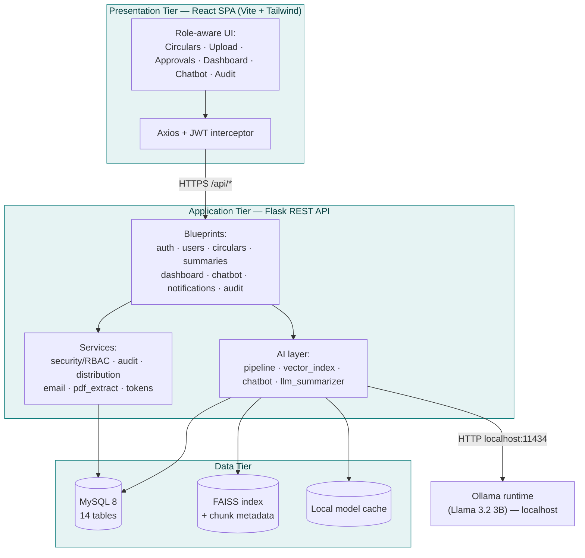
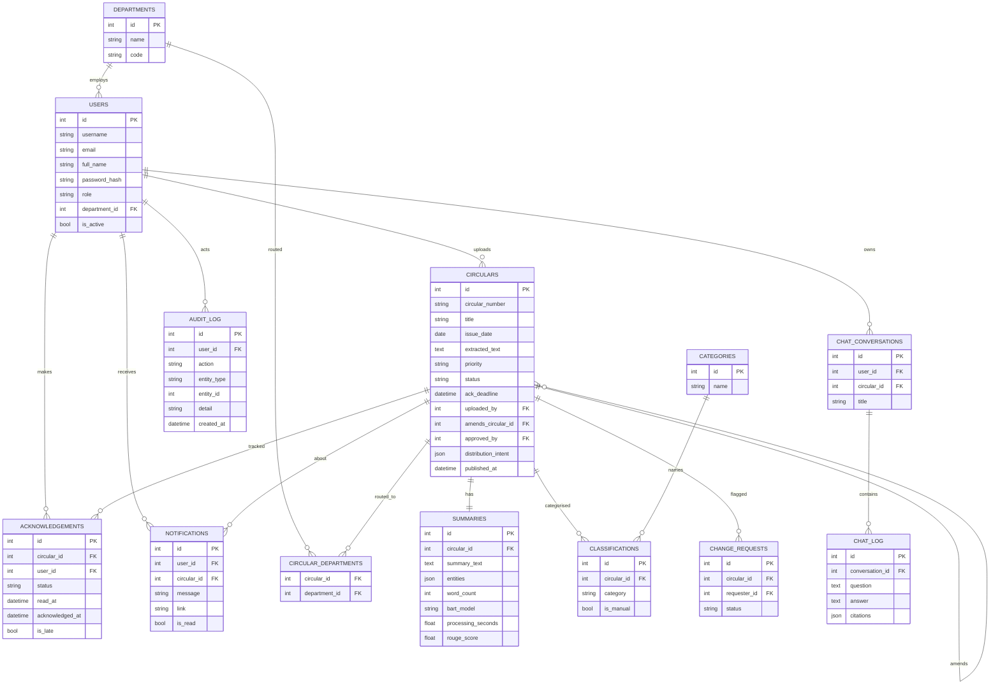
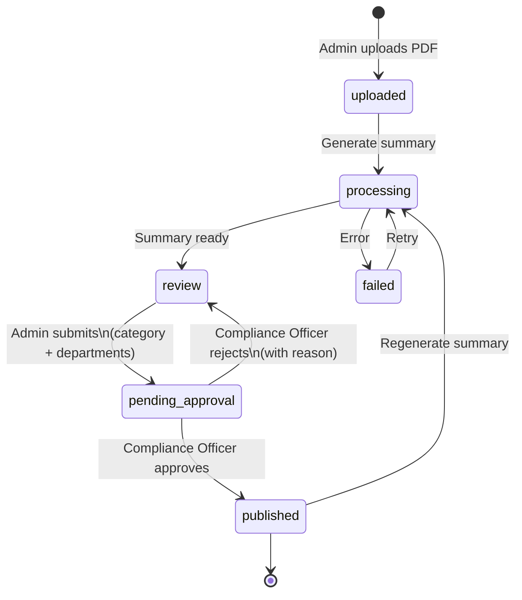
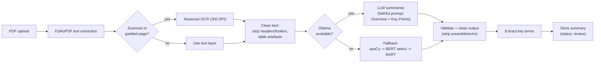
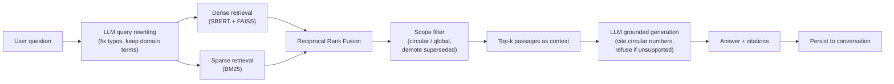
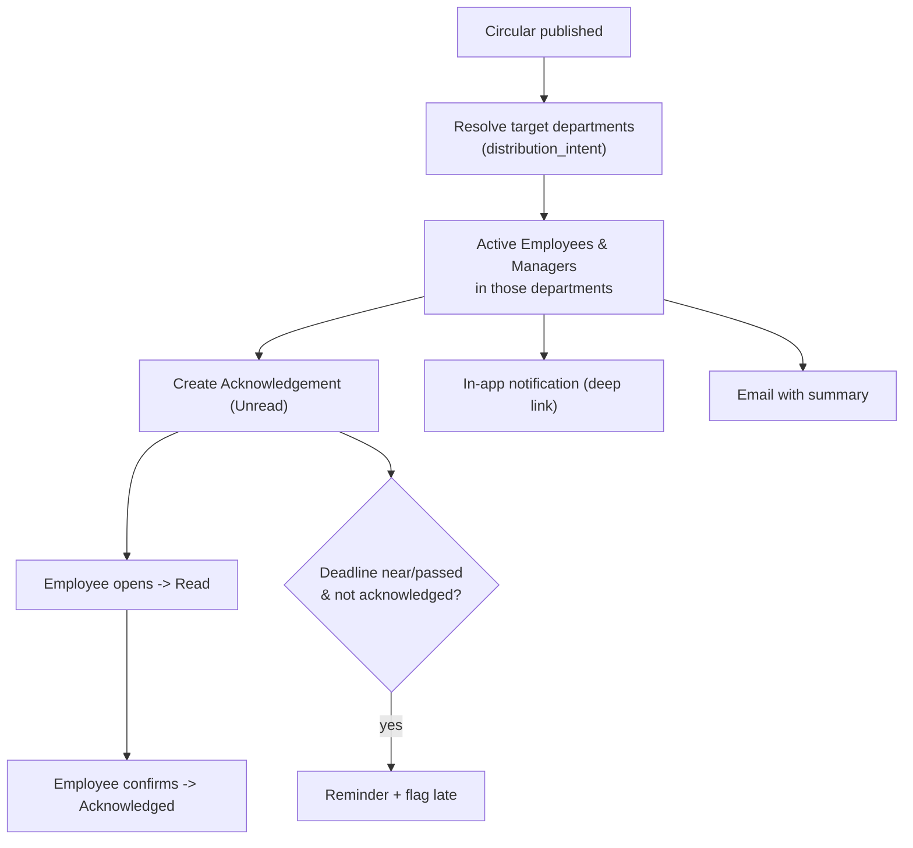

# Thesis Diagrams (Mermaid)

These render on GitHub and in Mermaid-aware editors (VS Code + Mermaid extension,
mermaid.live). To use in the thesis: paste into https://mermaid.live, then
**Export as PNG/SVG** and insert as a figure. Each diagram reflects the as-built
system.

---

## Figure 4.1 — System architecture (three-tier)



---

## Figure 4.2 — Entity–Relationship Diagram (core)



---

## Figure 4.3 — Circular lifecycle (state diagram)



---

## Figure 5.1 — Summarization pipeline (flowchart)



---

## Figure 5.2 — RAG chatbot pipeline (flowchart)



---

## Figure 5.3 — Four-eyes approval workflow (sequence diagram)

```mermaid
sequenceDiagram
    actor Admin as Administrator (Maker)
    participant Sys as System
    actor CO as Compliance Officer (Checker)
    actor Emp as Employees

    Admin->>Sys: Upload circular + generate summary
    Sys-->>Admin: Summary (status: review)
    Admin->>Sys: Submit for approval\n(category + departments)
    Sys->>Sys: status = pending_approval
    Sys-->>CO: Notify: awaiting approval
    CO->>Sys: Review summary
    alt Approve
        CO->>Sys: Approve
        Sys->>Sys: status = published; record approver
        Sys->>Emp: Route + notify + email
        Sys-->>Admin: Notify: approved & published
    else Reject
        CO->>Sys: Reject (with reason)
        Sys->>Sys: status = review
        Sys-->>Admin: Notify: rejected + reason
    end
    Note over Sys: Every step written to immutable audit log
```

---

## Figure 5.4 — Distribution & acknowledgement flow


